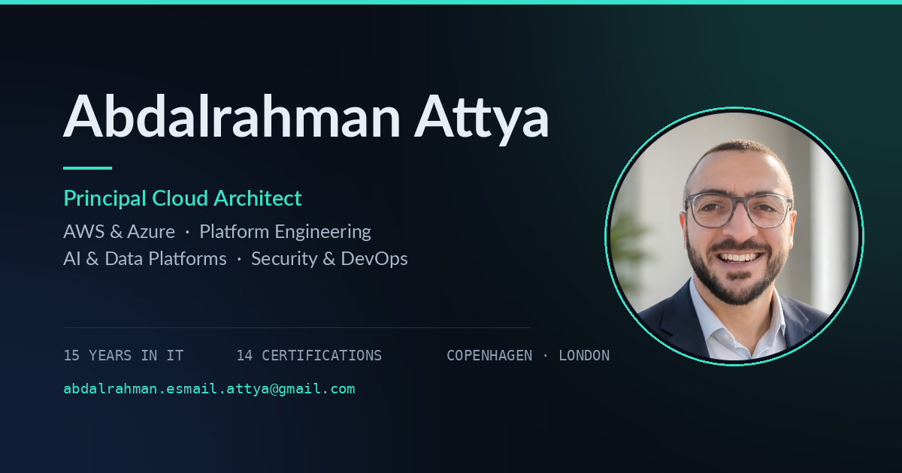
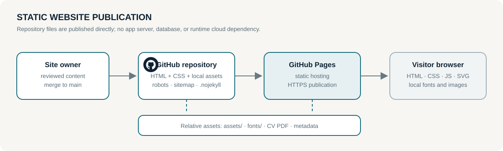

# Abdalrahman Attya — Portfolio site



This repository publishes the personal portfolio of **Abdalrahman Attya**, a
Principal Cloud Architect working across AWS, Azure, platform engineering,
security, DevOps, AI, and data platforms. The public site is available at
<https://abdalrahmanattya.github.io/>.

The site is intentionally a small, fast static publication. It presents:

- professional profile, locations, experience, education, and certifications;
- cloud architecture and platform-engineering services;
- selected case studies with explanatory architecture drawings;
- technology focus areas and delivery outcomes; and
- contact and professional-network links.

It is useful to prospective clients, hiring teams, and technical peers because
it provides a concise, evidence-aware view of cloud architecture experience,
delivery capabilities, and selected system designs in one fast, accessible
publication.

## How the site works

The site has no application server, database, API, build framework, or runtime
cloud dependency. GitHub Pages serves the repository's static files; a browser
loads `index.html`, its self-hosted fonts, local images, and inline CSS/SVG/JS.
The JavaScript is progressive enhancement for navigation, case-study tabs, and
small presentation behaviors. The page remains readable when scripting is
unavailable because the case-study panels render in sequence without JavaScript.



Source for the diagram is maintained in
[`docs/site-architecture.mmd`](docs/site-architecture.mmd). It describes the
publication path, not a separate cloud application or an infrastructure
deployment.

## Run and preview locally

No package installation is required. From the repository root:

```sh
python3 -m http.server 8000
```

Open <http://127.0.0.1:8000/> and check the responsive layout, navigation,
case-study tabs, images, fonts, contact links, and the 404 page at
<http://127.0.0.1:8000/404.html>.

For a lightweight static smoke test, use a second terminal while the server is
running:

```sh
curl --fail --silent http://127.0.0.1:8000/ | grep -q "Principal Cloud Architect"
curl --fail --silent -I http://127.0.0.1:8000/assets/og-card.png
curl --fail --silent -I http://127.0.0.1:8000/robots.txt
```

The repository has no build step or dependency lockfile. Before changing
content, validate HTML with an HTML validator available in your environment
and inspect the rendered page at desktop and mobile widths.

## Publishing and hosting

The intended hosting model is GitHub Pages at the custom repository URL above.
There is no tracked GitHub Actions deployment workflow in this repository and
no infrastructure-as-code deployment configuration. When Pages is enabled for
the repository's `main` branch and root directory, GitHub publishes the static
files directly; `.nojekyll` keeps the publication a plain static site.

Publishing is therefore a repository operation: review the content change,
merge it to `main`, and let the existing Pages configuration serve the updated
files. Hosting settings, DNS, TLS, and GitHub account controls are outside this
repository and must not be inferred from the files here.

## Repository map

| Path | Purpose |
| --- | --- |
| [`index.html`](index.html) | Complete portfolio page, including inline styles, SVG drawings, and progressive-enhancement JavaScript |
| [`404.html`](404.html) | Static not-found page |
| [`assets/`](assets/) | Headshots, avatar variants, certification badges, social preview card, and self-hosted first-party toolkit marks |
| [`assets/aa-mark.svg`](assets/aa-mark.svg) | Reusable site-owner monogram used by the favicon and 404 page |
| [`fonts/`](fonts/) | Self-hosted Lato and DejaVu Sans Mono webfonts |
| [`docs/asset-register.md`](docs/asset-register.md) | Provenance, usage, and fallback policy for logos and icon families |
| [`docs/site-architecture.mmd`](docs/site-architecture.mmd) | Maintainable Mermaid source for the publication diagram |
| [`docs/site-architecture.svg`](docs/site-architecture.svg) | Accessible rendered diagram shown above |
| [`robots.txt`](robots.txt) | Crawler guidance |
| [`sitemap.xml`](sitemap.xml) | Homepage sitemap entry |
| [`.nojekyll`](.nojekyll) | Tells GitHub Pages to publish as a plain static site |
| [`Abdalrahman-Attya-CV.pdf`](Abdalrahman-Attya-CV.pdf) | Downloadable CV linked from the portfolio |

## Current status

The published page is a stable, single-page portfolio with responsive layout,
keyboard-visible focus styles, semantic landmarks, accessible labels for
inline diagrams, local fonts, Open Graph metadata, JSON-LD profile metadata,
and a no-script fallback for case studies. Content claims and certification
details are maintained by the site owner; the repository does not make them
independent third-party attestations.

The visual system uses a reusable AA monogram, genuine public organisation
marks, exact AWS/Azure service icons in four public-project and three
professional case-study diagrams, and eight distinct neutral outline concepts
for the service cards and non-vendor steps. The publication keeps a concise
five-anchor navigation (Work, Services, About, Experience, Contact), a spacious
editorial hero, and a focused contact surface with no form backend.
The Technical Toolkit grid retains its original inline visual treatment; the
self-hosted vendor assets are documented for diagram use. See
[`docs/asset-register.md`](docs/asset-register.md) before adding any future
vendor or organisation logo.

## Privacy, security, and non-goals

- The site is a public professional profile. Do not place secrets, private
  client information, credentials, tokens, private endpoints, or unpublished
  project data in tracked files.
- Assets and fonts are served locally to avoid third-party runtime requests.
- The contact email and external professional links are intentionally public
  because they are part of the portfolio's contact surface.
- This repository does not provide authentication, visitor accounts, forms,
  analytics, payments, application APIs, cloud control-plane access, or
  infrastructure provisioning.
- Architecture drawings describe portfolio case studies and professional
  experience; they are explanatory illustrations, not deployment manifests or
  evidence that the depicted customer environments are currently running.
- Local working instructions and orchestration notes must remain untracked and
  excluded through `.git/info/exclude`; they are not part of the public site.

## Contributing content

Keep the publication static and dependency-free unless the site owner approves
a change in hosting or build model. Preserve accessible text alternatives for
drawings, keep links relative where possible, optimize new images, and verify
the rendered page locally before merging.
