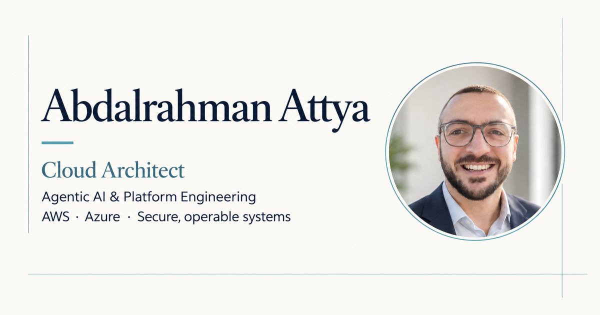
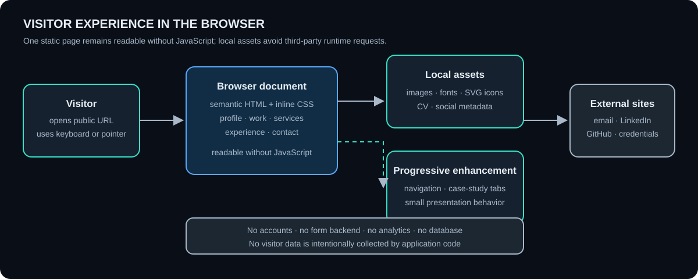

<!-- reader-first-readme:v1 -->

# Abdalrahman Attya — Professional website

This website gives visitors one place to understand Abdalrahman Attya's work across cloud architecture, agentic AI, and platform engineering. It connects current agentic-system work with the architecture, security, migration, and operational experience behind it, then provides selected projects, capabilities, professional context, credentials, and ways to make contact.

The benefit for engineering leaders is a concise view of both sides of production agentic AI: bounded agent behavior and the cloud architecture needed to make it secure, observable, reliable, and operable.

The public site is available at <https://abdalrahmanattya.github.io/>.



## The 30-second overview

A visitor can move through the site without needing to understand cloud or AI technology:

1. The opening introduces Abdalrahman as a cloud architect whose current focus includes agentic AI and platform engineering.
2. Selected work leads with agentic applications, then shows the developer-platform, modernization, and delivery foundations behind them.
3. Capabilities cover agent behavior, controlled tools, evaluation, coding-agent workflows, cloud architecture, data platforms, modernization, security, cost, and reliability.
4. About and Experience provide professional context and employment history.
5. Certifications and the technical toolkit show verified credentials and working technologies.
6. Contact provides direct email and professional-network links; there is no form or visitor account.

The page is intentionally static and fast. It does not require an application server, database, analytics service, or third-party font request.

## What people can do

- Understand how agentic AI and cloud architecture fit together in the professional focus.
- Explore selected public work and professional-impact case studies.
- Read architecture diagrams with text explanations and accessible labels.
- Review experience, education, and cloud certifications.
- Download the public CV.
- Follow links to GitHub, LinkedIn, and credential verification.
- Make contact by email or telephone.
- Navigate by keyboard, on a phone, or with JavaScript unavailable.

## A representative visitor journey

Suppose an engineering leader needs to move an AI assistant beyond a demonstration. They arrive on the home page and see Abdalrahman's agentic AI focus alongside 15 years of technology experience and principal-level cloud architecture depth. In Selected Work, they can examine how an agent uses knowledge, memory, and bounded tools while trusted application rules retain authority. The remaining cases show the cloud platforms, security controls, delivery systems, and modernization experience needed to operate that kind of system responsibly.

They continue to Services to understand the available engagement areas, then use Experience and Certifications to establish context. If the fit looks promising, they can open LinkedIn, download the CV, or send an email directly. The site does not ask them to register, accept tracking code, or submit information to a form backend.

## Privacy and trust boundaries

- The site is public, so tracked files must never contain private client material, credentials, tokens, private endpoints, or unpublished project data.
- Images, fonts, diagrams, and icons are served locally instead of loading from third-party asset services at runtime.
- Contact details and external professional links are intentionally public.
- There are no visitor accounts, forms, payments, application programming interfaces, analytics scripts, or application database.
- External sites receive a request only when a visitor chooses one of their links; those sites then apply their own privacy terms.
- Case-study diagrams explain architecture and delivery decisions. They are not infrastructure manifests or proof that a depicted environment is currently running.
- Certification claims link to their verification surface, while other professional claims remain maintained by the site owner rather than independently attested by this repository.

## System architecture: what happens in a visitor's browser



In plain language:

1. A visitor's browser receives semantic HTML documents with a shared local stylesheet.
2. Relative links load the local fonts, images, official service icons, diagrams, social card, and downloadable CV from the same website.
3. Small inline JavaScript improves homepage navigation when it is available.
4. Each selected-work card opens a dedicated, readable case-study page; the core content does not depend on JavaScript.
5. Email, GitHub, LinkedIn, credential, and source-code pages are separate external destinations opened only through visitor-selected links.

## Technology guide in plain English

| Technology | Its job in this site |
| --- | --- |
| HTML | Gives the page its headings, sections, links, images, and accessible meaning. |
| CSS | Controls the visual layout, responsive sizes, colors, typography, and visible keyboard focus. |
| JavaScript | Adds small homepage navigation conveniences; it is not required to read the core content or case studies. |
| SVG | Keeps architecture drawings, the AA mark, and many icons sharp at different screen sizes. |
| JSON-LD | Adds structured profile information that search engines can understand. |
| Open Graph metadata | Provides the title, description, and preview image used when the page is shared. |
| GitHub Pages | Publishes the repository's static files over HTTPS without a custom application server. |
| `.nojekyll` | Tells GitHub Pages to serve the files directly without running the Jekyll site generator. |

## Hosting and publication architecture

The site uses GitHub Pages rather than a separately managed cloud application.


For official provider icon provenance, the diagram's GitHub repository node uses the official GitHub mark from the MIT-licensed [Primer Octicons project](https://github.com/primer/octicons). A local copy and full asset provenance are maintained in the [asset and icon register](docs/asset-register.md). Cloud-service icons do not otherwise apply because this repository contains no AWS, Azure, or other infrastructure resources.

The site owner reviews content and merges it to the repository's `main` branch. GitHub Pages publishes the root files through the repository's existing Pages configuration. A visitor then receives `index.html` and its relative assets over HTTPS. There is no build pipeline, deployment package, runtime API, or infrastructure-as-code layer in between.

The GitHub Pages path shown in the diagram is currently deployed; no AWS, Azure, agent runtime, or other cloud application resources are planned or represented as part of this website.

### Deployment status

The website is currently published at the public address above. The repository itself records the files and `.nojekyll` publishing choice; GitHub account settings, Pages availability, domain-name service, transport security, and platform controls remain externally managed and must not be inferred solely from this code.

## What was tested

Recorded repository work includes:

- HTML structure, unique identifiers, internal anchors, link safety attributes, and references to local assets.
- SVG parsing and accessible titles/descriptions.
- Responsive overflow checks at phone, tablet, desktop, and wide-screen sizes.
- Mobile call-to-action placement, keyboard navigation, selected-work links, and active navigation mapping.
- Dedicated case-study readability without JavaScript and checks for browser console errors.
- Visual inspection of genuine organization marks, official cloud-service icons, neutral service illustrations, portraits, certification badges, and the social preview card.
- Local static-server requests for the page and key assets.

This repository has no dependency installation, compilation, unit-test framework, server-side behavior, or cloud-infrastructure test because none is part of the site. Visual and accessibility checks should be repeated whenever presentation or content changes.

## Important limitations

- Content, case studies, certification details, and availability can become outdated and require owner review.
- The site provides professional context, not an independent verification of every employment or delivery claim.
- There is no content-management system; updates are made directly in the repository.
- There is no search, localization, visitor personalization, form processing, analytics, or visitor-account functionality.
- GitHub Pages platform availability and controls are outside this repository.
- JavaScript improves homepage navigation, but the site intentionally omits search and client-side filtering.
- The contact surface intentionally exposes professional contact details to the public internet.

## Running the project locally

This section is for someone changing or operating the website. A non-technical reader can stop here without missing the site explanation.

### 1. Start a local web server

No package installation or cloud credentials are required. From the repository folder, run:

```sh
python3 -m http.server 8000
```

Open <http://127.0.0.1:8000/>. The not-found page is available at <http://127.0.0.1:8000/404.html>.

### 2. Review the experience

Check the navigation, every selected-work card and dedicated case page, local images and fonts, CV download, contact links, keyboard focus, and responsive layout at phone and desktop widths. Disable JavaScript once to verify that the core site and case studies remain readable.

### 3. Run lightweight delivery checks

With the local server still running, use a second terminal:

```sh
curl --fail --silent http://127.0.0.1:8000/ | grep -q "Agentic AI"
curl --fail --silent -I http://127.0.0.1:8000/assets/og-card-v2.png
curl --fail --silent -I http://127.0.0.1:8000/robots.txt
curl --fail --silent -I http://127.0.0.1:8000/docs/visitor-runtime.svg
```

Stop the server with `Ctrl+C` when finished.

## How to deploy using GitHub Pages

The exact deployment method is a repository update; there is no tracked deployment workflow or build command.

1. Confirm that every referenced asset is committed and the page passes local review.
2. Review the complete change for public information, link safety, accessibility, and asset provenance.
3. Commit the approved static files and push or merge them to the repository's `main` branch.
4. In repository settings, GitHub Pages must be configured to deploy from the `main` branch and repository root.
5. Wait for GitHub Pages to publish, then open <https://abdalrahmanattya.github.io/> and verify the changed content, main assets, navigation, and `404.html`.

Rollback uses the same path: revert the faulty content commit, merge or push the reviewed revert to `main`, and verify the public address after Pages republishes it. Changing repository, Pages, domain, or account settings is a separate administrative action.

## Repository map

| Location | Contents |
| --- | --- |
| `index.html` | Homepage content, structured metadata, retained SVG symbols, and progressive-enhancement JavaScript. |
| `styles.css` | Shared light-editorial visual system and responsive layouts. |
| `work/` | Nine dedicated public and professional case-study pages. |
| `404.html` | Static not-found page. |
| `assets` | Portraits, avatar variants, badges, official service icons, case diagrams, organization marks, toolkit marks, and social preview cards. |
| `fonts` | Self-hosted Lato and DejaVu Sans Mono files. |
| `docs/visitor-runtime.svg` | Browser experience and application-boundary diagram. |
| `docs/site-architecture.svg` | GitHub Pages publication and hosting diagram. |
| `docs/site-architecture.mmd` | Maintainable Mermaid source for the publication flow. |
| `docs/asset-register.md` | Sources, usage rules, and fallback decisions for visual assets. |
| `robots.txt` | Search-engine crawler guidance. |
| `sitemap.xml` | Public homepage and dedicated case-study sitemap entries. |
| `.nojekyll` | Direct static-publication instruction for GitHub Pages. |
| `Abdalrahman-Attya-CV.pdf` | Downloadable public CV. |

When contributing, keep the site static and dependency-free unless its owner approves a different hosting model. Preserve accessible text alternatives, prefer relative links, optimize new images, and add any new third-party mark to the asset register.
